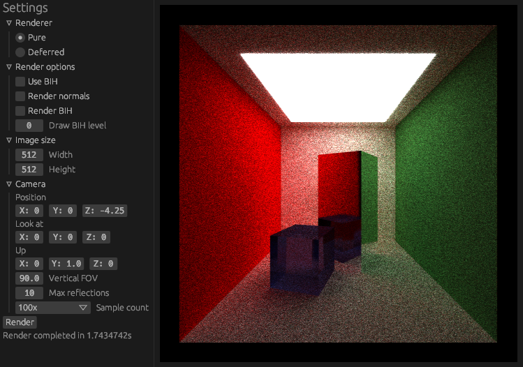

# eruptrace-rs

Offline 3D rendering engine based on ray tracing. Written in Rust, with Vulkan.

This project is part of my undergraduate project for BSc Computer Science with Industrial Placement (Game Engineering) at Newcastle University.



## How to build

Make sure you have `rustup` and `glslc` installed. Minimum recommended Rust version is 1.60.0.

First, build the shaders:

```shell
$ ./build_shaders.sh
```

And then build the application:

```shell
$ cargo +nightly build --release
```

To run the application, include the path to a scene directory in a command-line argument:

```shell
$ target/release/eruptrace-rs "example_scenes/cube"
```
